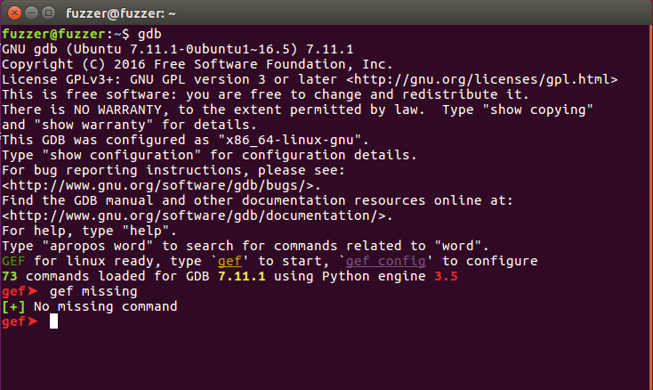

# replicate afl-unicorn-part-2
复现afl-unicorn第二篇博客，尽量用英文描述。

## [blog_url](https://hackernoon.com/afl-unicorn-part-2-fuzzing-the-unfuzzable-bea8de3540a5)

## prerequisites
1. base usage of bash/shell in Linux, like file system operation, install tools, gdb(the best)...  
2. base usage of [**AFL**](http://lcamtuf.coredump.cx/afl/)
    + instrumentation: ```./configure CC="afl-clang" CXX="afl-clang++"```
    + fuzz: ```afl-fuzz -i <input_dir> -o <output_dir> <application_command> # usage of '@@'```
    + other options: `-m`, `-t`, ...
3. base usage of [**afl-unicorn**](https://github.com/Battelle/afl-unicorn), see in [first_blog](https://hackernoon.com/afl-unicorn-fuzzing-arbitrary-binary-code-563ca28936bf)
    + use options: `-U`
    + should have the unicorn script
    + similar with afl: ```afl-fuzz -U -i <input_dir> -o <output_dir> -- <command of run unicorn script> # eg. python simple_test_harness.py @@```
4. at least, you should know what the blog_url saying, and if you don't know how to replicate it, you can follow after context.

## environment
1. OS: Ubuntu 16.04, 64-bits
2. tools: gdb 7.11 using Python engine 3.5 , Python2.7
3. we don't use ida pro because its python gdk isn't free, so we use gdb!

### install [GEF](https://gef.readthedocs.io/en/master/) - GDB Enhanced Features
1. `source gef.py`: `wget -q -O- https://github.com/hugsy/gef/raw/master/scripts/gef.sh | sh`
2. dependencies: `pip3 install capstone unicorn keystone-engine ropper`
3. run `gdb` to check if install successfully
    + if show the keystone has not installed, can `pip3 install keystone`
    + if show `module 'keystone' has no attribute 'KS_ARCH_X86'`, [see bottom of this website](https://docs.angr.io/introductory-errata/install), or `pip3 install --no-binary keystone-engine keystone-engine`. I have comment in the [issue#243](https://github.com/keystone-engine/keystone/issues/243)
4. other problems about keystone-engine or keystone, you can install by the [source](https://github.com/keystone-engine/keystone) and remember [binding with python3](https://github.com/keystone-engine/keystone/tree/master/bindings/python)
5. install successfully like this: **no gef missing** 

## FSK_Messaging_Service

### run FSK_Messaging_Service
1. get source [code](https://github.com/trailofbits/cb-multios) and build it!
    + ***important***: before building, please replace `cb-multios/challenges/FSK_Messaging_Service/pov_1/pov.c` with [`issues#9`](https://github.com/Battelle/afl-unicorn/issues/9)
2. path `cb-multios/build/challenges` correspondence with the path `cb-multios/challenges`, this blog only focus on `FSK_Messaging_Service`. when we build successfully, the binary will in the `cb-multios/build/challenges/FSK_Messaging_Service`
3. run `FSK_Messaging_Service`(`cd cb-multios/build/challenges/FSK_Messaging_Service`):
    + generate the input of FSK_Messaging_Service: `./pov_1.pov > fsk_packet`(ctrl+d for stop), for debug in gdb, you must do this!
    + run: `./FSK_Messaging_Service < fsk_packet`
    + or `./FSK_Messaging_Service < ./pov_1.pov`(ctrl+d for stop)

### debug with gdb and dump it
1. gdb: `gdb FSK_Messaging_Service`
2. we should set the breakpoint of starting address of `cgc_receive_packet()`, but in the blog, we set before calling it, so you should find where the code call this function. It's in the end of `cgc_reset_baseband_state()` in `src/baseband.c`.
3. disassembly and set breakpoints:
    + `gef> disas cgc_reset_baseband_state`
    + set breakpoints refer to the figure in the blog: `break *address`
4. other entries address see `fsk_message_service_test_harness.py` in the blog, and ***update*** them:
    + START_ADDRESS & END_ADDRESS: refer previous point.
    + CHKSUM_CMP_ADDR & CHKSUM_PASSED_ADDR: find in `disas cgc_receive_packet`
    + MALLOC_ENTRY, FREE_ENTRY, PRINTF_ENTRY, CGC_TRANSMIT_ENTRY: find in `disas <function>`
5. run FSK in the gdb:
    + run `./FSK_Messaging_Service < fsk_packet` to the breakpoint
    + [start]dump it: `source path/to/unicorn_dumper_gdb.py`, and output `Unicorn Context` dir likes the blog(some *.bin and a .json).
    + run again.
    + [**end**]dump it again.

## afl-unicorn it!
1. `afl-fuzz -U -m none -i /path/to/inputs/ -o /path/to/results/ -- python fsk_message_service_test_harness.py /path/to/context_dir/ @@`
    + `/path/to/inputs/`: remember fsk_packet? yeah, mkdir and copy it, just one inputs can crash in this blog.
    + `/path/to/results/`: whatever you want.
    + `/path/to/context_dir/`: the Unicorn Context dir(some *.bin and a .json)!
2. I have to say, python in this command is Python2! not Python3!
3. I just crash **end**_dump in 5 min.

## other
if you have any question, you can:<br>
1. see [blog](https://hackernoon.com/afl-unicorn-part-2-fuzzing-the-unfuzzable-bea8de3540a5) one more time, recommend!
2. ask [authors](https://github.com/trailofbits/cb-multios/issues) in issues, recommend!
3. ask [me](517862788@qq.com) or issues, I would like to answer the question if I know.